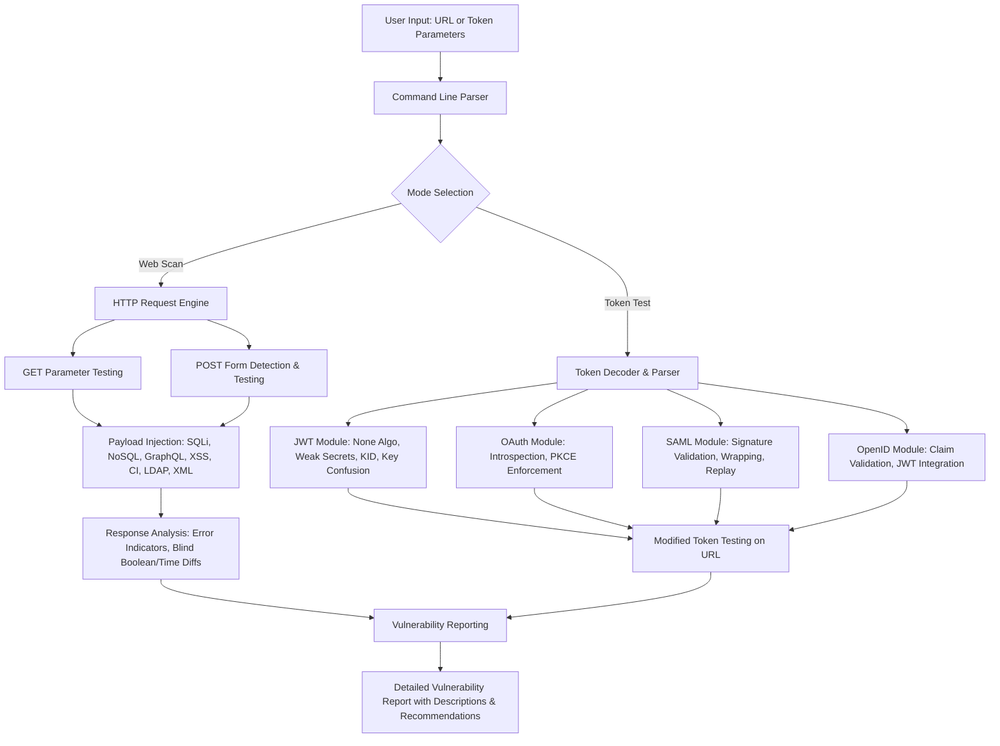

# Multi-Vulnerability and Token Security Scanner Tool

The Multi-Vulnerability and Token Security Scanner is a comprehensive Python-based utility designed for security analysts, penetration testers, and developers to identify and assess a wide spectrum of vulnerabilities in web applications and authentication tokens. This tool automates the detection of injection vulnerabilities, including SQL Injection (SQLi), NoSQL Injection, GraphQL Injection, Cross-Site Scripting (XSS), Command Injection (CI), LDAP Injection, and XML External Entity (XXE) Injection. It utilizes diverse detection techniques, such as error-based analysis, boolean-based blind testing, and time-based blind testing, to reveal vulnerabilities even in applications that do not display explicit error messages. In addition, the tool features specialized modules for scrutinizing authentication tokens, including JSON Web Tokens (JWT), OAuth 2.0 access tokens, SAML assertions, and OpenID Connect ID tokens. These modules evaluate for common security flaws, such as algorithm weaknesses, signature misconfigurations, key confusion, expiration and issuance time issues, replay vulnerabilities, and more.

The scanner functions by dispatching carefully constructed payloads to target URLs via GET parameters or POST forms and examining the responses for vulnerability indicators. For token analysis, it decodes, validates, and alters tokens to detect potential exploitation vectors. All testing is intended for ethical and authorized use, with a strong emphasis on obtaining explicit permission prior to any assessment to comply with legal and professional standards.

## Key Features

- **Wide-Ranging Vulnerability Detection**: Identifies SQL Injection using error-based, union-select, blind boolean, and time-based methods, supporting various databases like MySQL, PostgreSQL, MSSQL, and Oracle. Extends coverage to NoSQL Injection (error-based and blind time-based), GraphQL Injection (error-based with introspection leakage checks, blind boolean and time-based), XSS (reflected through script alert indicators), Command Injection (time-based via response delays and output-based via echoed unique markers), LDAP Injection (error-based and blind boolean), and XML Injection (XXE with indicators of file disclosure or out-of-band data exfiltration).

- **Customizable Payloads and Indicators**: Permits the loading of custom payloads and error indicators from text files for each vulnerability category (one per line), allowing testers to adapt the tool to specific application behaviors, database types, or newly discovered exploit patterns. This flexibility ensures the scanner can be fine-tuned for targeted assessments or integration into custom security workflows.

- **Advanced Blind Detection Logic**: Offers configurable blind testing modes (boolean, time, or both) for SQL/NoSQL, LDAP (boolean only), and GraphQL, with adjustable delay durations for time-based tests and similarity thresholds for boolean comparisons (using difflib to measure response content differences). This optimization reduces false positives and enhances detection in silent or rate-limited environments.

- **HTTP Method and Form Handling**: Directly tests GET query parameters and automatically detects HTML forms for POST submissions (requiring BeautifulSoup for parsing). Includes support for custom request timeouts to handle slow networks, user-agent strings for evasion or compliance, and verbosity levels for output control (minimal for quick overviews, detailed for in-depth analysis, debug for full traces).

- **Robust Token Security Evaluation**:
  - **JWT Analysis**: Decodes tokens without signature verification, tests for 'none' algorithm acceptance (generates and submits a modified none token to a test URL), checks for weak HMAC secrets using a list of common values, evaluates KID headers for injection risks (e.g., SQLi or path traversal), and performs RS256 to HS256 key confusion tests (fetches public keys from JWKS, uses them as symmetric secrets for verification, and tests modified HS256 tokens on a provided URL).
  - **OAuth 2.0 Analysis**: Introspects tokens via a specified endpoint to verify activity status, and assesses PKCE enforcement by attempting authorization code requests without code_challenge parameters to detect if the server permits non-PKCE flows (vulnerable to code interception).
  - **SAML Analysis**: Parses base64-encoded or raw XML, validates structural elements (e.g., Assertion, Signature, Conditions), checks for unsigned assertions, expiration (NotOnOrAfter), tests unsigned tokens by removing signatures, performs signature wrapping by duplicating assertions with malicious modifications (e.g., changing NameID to 'admin') while relocating the signature, and evaluates replay vulnerability by resubmitting the original token multiple times to the test URL.
  - **OpenID Connect Analysis**: Validates ID token claims (issuer 'iss', audience 'aud', nonce, state, expiration 'exp', issued-at 'iat'), and integrates with JWT testing for signature, algorithm, and confusion issues, providing a holistic check for OpenID-specific misconfigurations.

- **Progress Monitoring and User Feedback**: Employs tqdm for visual progress bars during multi-payload tests, aiding in tracking long scans. Verbosity settings allow tailored output, from high-level vulnerability alerts to verbose debugging with request/response details.

- **Ethical Design Principles**: Built exclusively for authorized security assessments, with documentation emphasizing legal compliance, permission requirements, and responsible disclosure. The tool avoids any exploitative or destructive actions, focusing solely on detection.

## Toolkit Architecture Diagram

Below is a Mermaid diagram illustrating the high-level architecture of the scanner tool, showing how the web vulnerability scanning components interact with the token testing modules. The diagram depicts the main flows: input processing, vulnerability testing branches, token analysis paths, and output reporting.



This diagram represents the tool's modular structure, where web scanning and token testing are separate but share reporting mechanisms. The HTTP engine handles web interactions, while token modules focus on parsing and manipulation.

## Installation and Setup

To set up the scanner, ensure the following prerequisites are met for optimal performance.

1. **Install Python 3**: The tool requires Python 3.8 or higher. Download and install from the official Python website (python.org) if not already present. Confirm the version by executing `python --version` in a terminal.

2. **Install Required Libraries**: Use pip to install the necessary dependencies. Run the command below in a terminal:

   ```
   pip install requests beautifulsoup4 tqdm pyjwt cryptography lxml
   ```

   Each library serves a specific purpose:
   - `requests`: Facilitates HTTP requests for vulnerability probing and API interactions.
   - `beautifulsoup4`: Enables HTML parsing to locate and test POST forms.
   - `tqdm`: Displays progress bars for iterative testing loops.
   - `pyjwt`: Handles JWT decoding, encoding, and signature operations.
   - `cryptography`: Manages public key extraction and cryptographic validations for key confusion tests.
   - `lxml`: Provides efficient XML parsing and manipulation for SAML and XXE assessments.

3. **Save the Script**: Copy the full script code into a file named `vuln_scanner.py`. On Linux or macOS, make it executable with `chmod +x vuln_scanner.py` for convenience.

4. **Additional Notes**: The tool does not require root privileges or special permissions. For token tests involving remote endpoints (e.g., JWKS, introspection), ensure network connectivity. If using in a virtual environment, activate it before installing libraries.

## Usage

The scanner is invoked via the command line, supporting web scanning on URLs and independent token testing. For web scans, provide a URL with query parameters or forms. For token tests, specify the token and supporting parameters without a URL.

### Web Vulnerability Scanning

The base command for scanning a URL is:

```
python vuln_scanner.py <URL> [OPTIONS]
```

- **<URL>**: The target endpoint, e.g., `http://example.com/vulnerable?param=test`. The tool tests parameters in the query string for GET and parses the page for POST forms.

Example 1: Basic SQLi Scan

```
python vuln_scanner.py http://example.com/page?id=1
```

This sends built-in SQLi payloads to the 'id' parameter and checks for error indicators like "sql syntax" or "unexpected end of sql".

Example 2: Comprehensive Scan with Blind Testing

```
python vuln_scanner.py http://example.com --blind both --blind-ldap --blind-graphql --test-nosql --test-graphql --test-xss --test-ci --test-ldap --test-xml --delay-sec 10 --diff-threshold 0.9 --verbosity 1 --timeout 20
```

This enables all vulnerability types, blind modes, with a 10-second delay for time-based tests, 90% similarity threshold for boolean, detailed output, and 20-second timeout.

Example 3: Custom Payloads

```
python vuln_scanner.py http://example.com --payloads sql_payloads.txt --xss-payloads xss_list.txt --errors custom_errors.txt --user-agent "TestAgent/1.0"
```

This uses custom files for SQLi and XSS payloads, error indicators, and a custom User-Agent.

### Standalone Token Testing

Token tests can be run without a URL by specifying the relevant flags.

Example 1: JWT Testing with Key Confusion

```
python vuln_scanner.py --jwt eyJhbGciOiJSUzI1NiJ9.eyJzdWIiOiIxMjMifQ.signature --jwks-url https://auth.example.com/jwks.json --test-jwt-url https://api.example.com/protected --verbosity 2
```

This decodes the token, tests none algorithm (generates and submits a none token to the test URL), checks for weak HS secrets if applicable, notes KID risks, and if RS256, performs key confusion by using the public key as an HS secret for verification and testing a modified HS256 token on the URL.

Example 2: OAuth 2.0 Testing with PKCE Check

```
python vuln_scanner.py --oauth-token access_token --introspection-endpoint https://oauth.example.com/introspect --client-id client --client-secret secret --authorization-endpoint https://oauth.example.com/authorize --redirect-uri https://client.example.com/callback
```

This introspects the token for activity and tests the authorization endpoint for PKCE by requesting a code without code_challenge, reporting if non-PKCE is allowed.

Example 3: SAML Testing with Replay and Wrapping

```
python vuln_scanner.py --saml base64_saml_xml --test-saml-url http://example.com/saml-endpoint --saml-header SAML-Assertion
```

This parses the SAML, validates structure/signature/expiration, tests an unsigned version, applies signature wrapping with a malicious duplicate assertion, and checks for replay by double-submitting.

Example 4: OpenID Connect ID Token Validation

```
python vuln_scanner.py --openid-id-token id_token --issuer https://openid.provider.com --client-id client --nonce nonce_value --state state_value --test-jwt-url http://example.com/openid-protected
```

This checks OpenID claims and runs JWT tests, reporting mismatches or expiration issues.

## Ethical Considerations and Legal Disclaimer

This tool is developed and distributed for ethical security research, authorized penetration testing, and educational purposes only. Users are solely responsible for ensuring all activities comply with applicable laws, regulations, and ethical standards. Obtain explicit, documented permission from system owners before scanning any URL or testing tokens. Unauthorized use may infringe on privacy rights, breach contracts, or violate laws like the Computer Fraud and Abuse Act (CFAA) in the United States, the Computer Misuse Act in the United Kingdom, or similar international statutes, potentially resulting in legal consequences.

The tool's creators disclaim all liability for misuse, including any damages, data loss, or legal issues arising from its application. Promote responsible disclosure: If vulnerabilities are found, notify affected parties promptly and allow reasonable time for remediation before public release. Reference resources like the OWASP Cheat Sheet Series or NIST guidelines for best practices in vulnerability testing and token security. By using this tool, you agree to these terms.

## License

This project is licensed under the MIT License.

Permission is hereby granted, free of charge, to any person obtaining a copy of this software and associated documentation files (the "Software"), to deal in the Software without restriction, including without limitation the rights to use, copy, modify, merge, publish, distribute, sublicense, and/or sell copies of the Software, and to permit persons to whom the Software is furnished to do so, subject to the following conditions:

The above copyright notice and this permission notice shall be included in all copies or substantial portions of the Software.

THE SOFTWARE IS PROVIDED "AS IS", WITHOUT WARRANTY OF ANY KIND, EXPRESS OR IMPLIED, INCLUDING BUT NOT LIMITED TO THE WARRANTIES OF MERCHANTABILITY, FITNESS FOR A PARTICULAR PURPOSE AND NONINFRINGEMENT. IN NO EVENT SHALL THE AUTHORS OR COPYRIGHT HOLDERS BE LIABLE FOR ANY CLAIM, DAMAGES OR OTHER LIABILITY, WHETHER IN AN ACTION OF CONTRACT, TORT OR OTHERWISE, ARISING FROM, OUT OF OR IN CONNECTION WITH THE SOFTWARE OR THE USE OR OTHER DEALINGS IN THE SOFTWARE.
```
